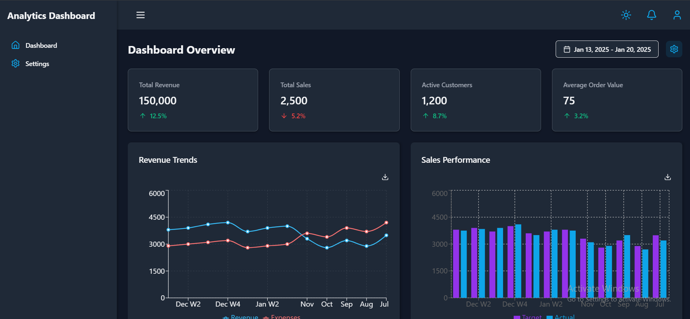

# Analytics Dashboard

A responsive analytics dashboard application built using React and Tailwind CSS. The dashboard provides visual representations of key metrics and trends, making it ideal for business analytics and monitoring performance.

## Features

- **Dashboard Overview**:
  - Total Revenue
  - Total Sales
  - Active Customers
  - Average Order Value
- **Charts and Visualization**:
  - Revenue Trends (Line Chart)
  - Sales Performance (Bar Chart)
- **Interactive Components**:
  - Date range selector
  - Dark/Light mode toggle

## Screenshot



## Live Demo
[View Live Demo](https://dashboard-puce-tau-66.vercel.app/)

## Repository
[GitHub Repository](https://github.com/Ram-bot-web/dashboard)

## Setup Instructions

### Prerequisites

Ensure you have the following installed:
- Node.js (v14 or later)
- npm or yarn

### Steps

1. Clone the repository:
   ```bash
   git clone https://github.com/Ram-bot-web/dashboard.git
   ```

2. Navigate to the project directory:
   ```bash
   cd dashboard
   ```

3. Install dependencies:
   ```bash
   npm install
   # or
   yarn install
   ```

4. Start the development server:
   ```bash
   npm start
   # or
   yarn start
   ```

5. Open the app in your browser at `http://localhost:3000`.

### Build for Production

To build the project for production:
```bash
npm run build
# or
yarn build
```

### Environment Variables

If applicable, include a `.env` file in the root directory with the following structure:
```
REACT_APP_API_BASE_URL=<your-api-url>
```

## Architecture Overview

- **React**: Component-based architecture for building the UI.
- **Tailwind CSS**: Utility-first CSS framework for styling.
- **Recharts**: For data visualization (line and bar charts).
- **Vite**: Fast build tool for modern web applications.
- **State Management**: React Context API for managing global state (if needed).

## Key Decisions/Trade-offs

- **Tailwind CSS** was chosen for its flexibility and rapid prototyping capabilities.
- **Recharts** for its ease of use and compatibility with React.
- **Vite** was used over Create React App due to its faster build and development speed.

## Known Issues/Limitations

- The dashboard is currently optimized for desktop screens. Responsive behavior on smaller screens needs further testing.
- Real-time data updates are not implemented yet.

## Time Spent on Implementation

Approximately **15 hours**, distributed as follows:
- **6 hours**: Building the UI components
- **4 hours**: Integrating charts and Tailwind CSS
- **2 hours**: Adding interactivity (e.g., date range picker, dark mode toggle)
- **3 hours**: Testing and debugging

## Challenges Faced

1. **State Management**:
   Handling shared state across components for the dark/light mode toggle.

2. **Chart Customization**:
   Adjusting the chart configurations to align with the overall design aesthetic.

3. **Responsive Design**:
   Ensuring the dashboard adapts well to different screen sizes.

## Submission Guidelines Checklist

- [x] Complete source code
- [x] README with setup instructions, architecture overview, key decisions/trade-offs, and known issues/limitations
- [x] `package.json` with all dependencies
- [x] Tailwind configuration file
- [x] Environment variables template (if applicable)
